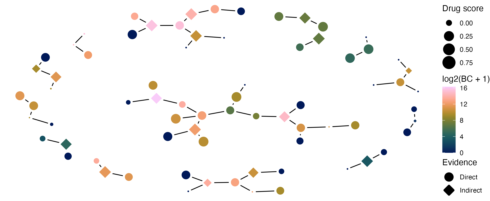

# A new method for network bioinformatics identifies novel drug targets for Mucinous Ovarian Carcinoma

Code associated with "A new method for network bioinformatics identifies novel drug targets for Mucinous Ovarian Carcinoma"

Olivia Craig, Samuel Lee, Courtney Pilcher, Rita Saoud, Suad Abdirahman, Carolina Salazar, Nathan Williams, David B Ascher, Robert Vary, Jennii Luu, Karla J Cowley, Susanne Ramm, Mark Xiang Li, Niko Thio, Jason Li, Tim Semple, Kaylene J Simpson, Kylie L Gorringe, Jessica K Holien, A new method for network bioinformatics identifies novel drug targets for mucinous ovarian carcinoma, NAR Genomics and Bioinformatics, Volume 6, Issue 3, September 2024, lqae096, https://doi.org/10.1093/nargab/lqae096

Code written by Sam Lee (@samleenz) under supervision of Jessica Holien

## Packages

- BiocParallel
- DESeq2
- ggraph
- igraph
- tidyverse
- WGCNA

### nedd

- [github repository](https://github.com/samleenz/nedd)

```r
library(devtools)
install_github("samleenz/nedd")
```

### PCSF

- The package PCSF has been removed from Bioconductor since this project was conducted. It is currently available from https://github.com/IOR-Bioinformatics/PCSF 

Follow the instructions here to install https://github.com/IOR-Bioinformatics/PCSF/issues/8#issuecomment-778879292

```R
if (!requireNamespace("BiocManager", quietly = TRUE))
    install.packages("BiocManager")
devtools::install_github("IOR-Bioinformatics/PCSF", repos=BiocManager::repositories(),
                         dependencies=TRUE, type="source", force=TRUE)
```

# Results object

The primary results are in `data/2020-02-06_moc_pcsf_wgcna_snp_results_filterdot01_diffI.RData` which contains

- `g_diff_asch`: the differential MOC network based on the Ascher PPI graph
- `pcsf_ranks`: a data-frame of the 85 ranked proteins from `PCSF`
- `pcsf_res`: The PCSF output graph
- `pcsf_res_stats`: a data-frame with network statistics of the `pcsf_res` graph

# Figures

Generated using `R/2023_manuscript_figures_pcsfNetwork.R`




# Code files

Code used to generate the results in this manuscript. Note: this cannot be re-run without access to the MOC patient gene expression data that is used to select initial genes for analysis.

| Code                                    | Use                                                                 |
|-----------------------------------------|---------------------------------------------------------------------|
| `moc_de_staged_versus_benign.R`         | R script for differential expression analysis between staged and benign samples. |
| `moc_wgcna_staged_versus_benign.R`      | R script for WGCNA analysis comparing staged and benign samples.    |
| `moc_wgcna_make_3col_adjacency.R`       | R script for creating 3-column adjacency matrix from WGCNA.        |
| `moc_wgcna_filter_edgelist.sh`          | Example awk code to filter the 3 column adjaceny tables for strong interactions. |
| `moc_wgcna_make_cost.R`                 | Convert WGCNA scores to edge costs as needed for PCSF.                      |
| `moc_wgcna_ben_make_cost.R`             | Convert WGCNA scores to edge costs as needed for PCSF.                      |
| `moc_wgcna_cost_intersect_ascher.R`     | Filter the WGCNA graph for interactions supported by the PPI         |
| `moc_pcsf_wgcna_diff_i_snp.R`           | R script for running PCSF on the filtered cost graph  |
| `2023_manuscript_figures_pcsfNetwork.R` | R script for creating PCSF network figures for the manuscript. |
| `functions.R`                           | R script containing various functions used in the analysis or EDA.         |

